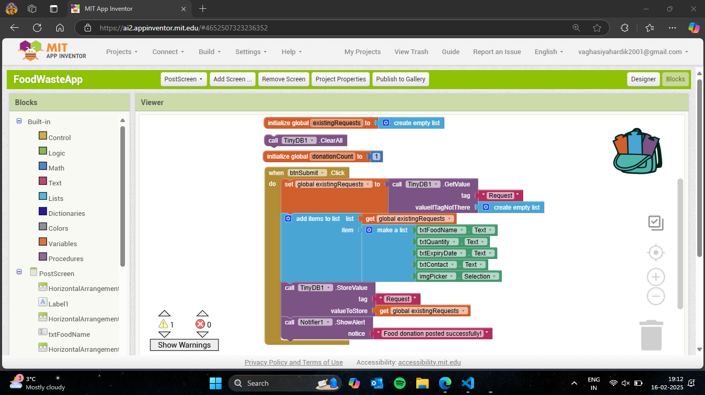
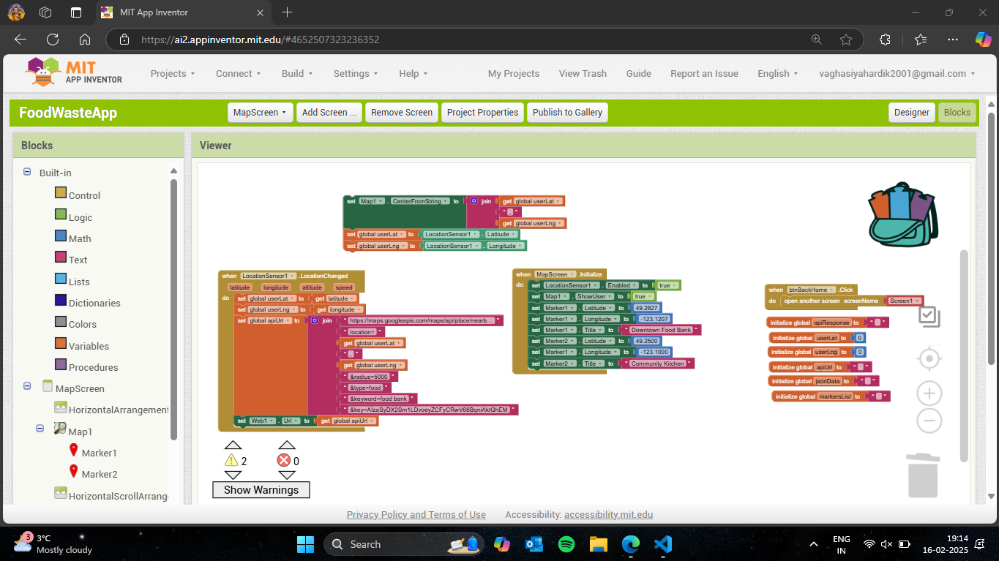

# Food Donation App

   

# Project Ovewview

**App Name** - Food Waste App

This app is made to designed to bridge the gap between the food donor and the recipients. This app will minimize the food wastage and  will enable users to donate surplus food and allows recipients to request available food where they will find all the details of food and contact of that person.

# Features

✅ **User-friendly Interface:** A simple and interactive design for easy navigation.

✅ **Multi-screen Navigation:** Different screens for donors and recipients.

✅ **Food Listing:** Display available food donation dynamic.

✅ **Image Upload:** Donors can upload image of food.

✅ **Data Storage:** Uses TinyDB for data storage.

✅ **Error Handling:** Alerts and validation to prevent incorrect inputs.

# Main components Used

* Drag & Drop Block Programming.
* TinyDB for local storage.
* Event-driven like button clicks, listview, selection, etc..
  
# App Architecture

This app is designed in MIT App Inventor using code block programming.

1. Home Screen - User will be able to get options like View food banks near them, Post food donation and request food.
   
   

2. PostScreen- Allow user to Post there food and there details.
   
   

3. Map Screen - User will be able to find nearby foodbanks (in future).

   

4. Request Screen- Display the food list available.

    

5. Donor Request Screen - Where user will find details of donor

    

# Code Block 
    

    

    

    

    

# Installation & Setup

1. Open MIT App Inventor.
2. Import the `.aia` project file into your MIT app inventor workspace.
3. Connect to emulator or device to test the app.
4. Build and export the app as an `.apk` file for installation

# Challenges & Solutions

1. Data Retrieval issues
   Issue: TinyDB data retrieval was returning an empty list.
   Solution: Implement proper tag usage and debugged data storage.

2. Runtime Error: List Index out of range
   Issue:Selecting an empty list caused app crash.
   Solution: Added validation to check empty list selections.

3. Map Data Not Displaying Propely
   Issue: The app is currently not able to fetch and display exact data.
   Solution: For temporary measure, location are being added manually until a proper api is not get.

# Conclusion

Using MIT App Inventor, the Food Donation App effectively illustrates important programming ideas such as user interface design, data storage, error management, and user navigation. 

# References

**MIT offical Documentation**   
https://appinventor.mit.edu/explore/ai2/tutorials

**Google Maps API**  https://developers.google.com/maps/apis-by-platform

**Open Street Map API**  https://www.openstreetmap.org/#map=19/49.682957/-125.001009&layers=N

